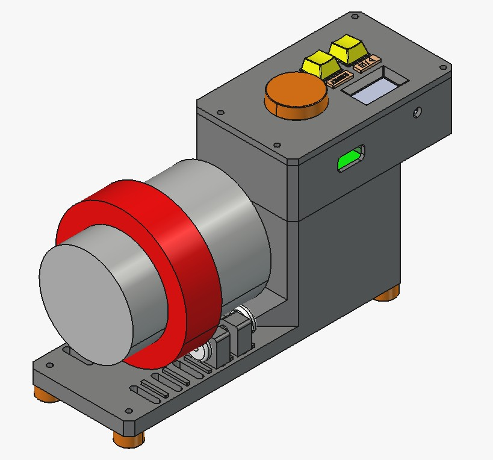
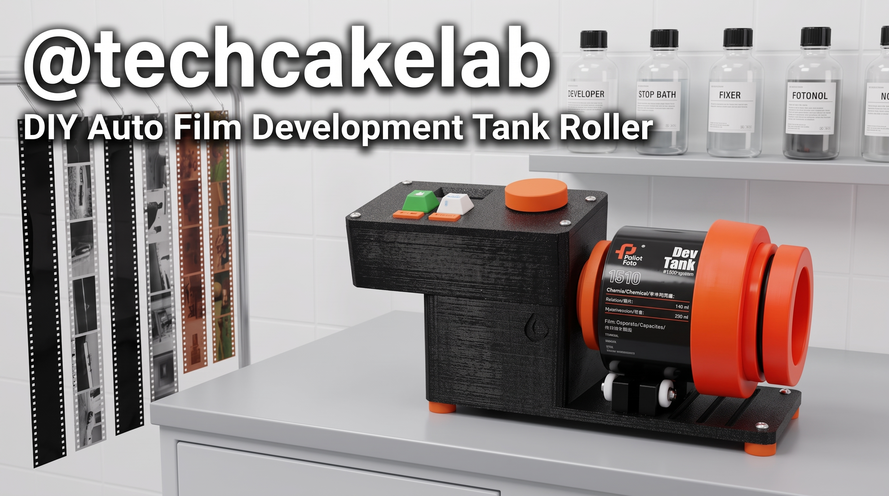

# DIY - Auto Developing Tank Roller - Universal Timer

Automatic bi-directional film developing rotator, designed as a **Universal Timer** - no pre-set cycles, manually adjustable time and speed for any type of chemical.

## Features
- **Universal Timer:** Set custom time (0.5 – 30 minutes) and speed (10 – 100 RPM) via KY-040 rotary encoder.
- **Auto Reverse:** Motor runs FWD 10s → pauses 1s → REV 10s → repeats throughout the set time.
- **PID Control:** Maintains stable speed at target RPM using a motor encoder.
- **OLED Display:** Shows remaining time, progress bar, actual / target speed.

## Hardware

### Components
- Microcontroller: **ESP32**
- Motor Driver: **L298N Motor Driver Module**
- Motor: **JGB37-520 DC Gear Motor with Quadrature Encoder**
- Step-Down Converter: **Mini560 5V/5A Buck Converter**
- Display: **OLED SH1106G 128x64** (I2C, address `0x3C`)
- Controls: **KY-040 Rotary Encoder** + **2 Push Buttons**

### Wiring Diagram

| Component | Function | ESP32 Pin |
| :--- | :--- | :--- |
| **Button 1** | Start / Stop | `GPIO 13` |
| **Button 2** | Reset to IDLE | `GPIO 14` |
| **KY-040** | Push Button (SW) – Toggle TIME ↔ RPM | `GPIO 25` |
| **KY-040** | CLK Pulse | `GPIO 32` |
| **KY-040** | DT Pulse | `GPIO 33` |
| **Motor Encoder** | Channel A | `GPIO 34` |
| **Motor Encoder** | Channel B | `GPIO 35` |
| **L298N** | ENA (PWM Speed) | `GPIO 26` |
| **L298N** | IN1 (Direction) | `GPIO 27` |
| **L298N** | IN2 (Direction) | `GPIO 16` |
| **I2C (OLED)** | SDA / SCL | `GPIO 21` (SDA) / `GPIO 22` (SCL) |

> **Important note for L298N module:** In order to control speed with PID, you **MUST remove the jumper (gold/black cap)** plugged into the `ENA` pin (or `ENB` if using port B). After removing the jumper, connect a wire from the `ENA` pin on the L298N board to `GPIO 26` of the ESP32. If you do not remove the jumper, the motor will always run at maximum speed (100%) and you will not be able to adjust the RPM.

## Usage

### SETUP Screen (Before Running)
1. **Rotate KY-040:** Increase/decrease the selected parameter, each click = 15 seconds (for Time) or 1 RPM.
2. **Press SW (KY-040):** Toggle between **TIME** ↔ **RPM**. The `>` sign indicates the currently selected parameter.
3. **Press Button 1:** Start running (START).

### RUNNING Screen (While Running)
- Displays countdown time, progress bar, and actual speed.
- **Rotate KY-040:** Change target RPM on-the-fly (after pressing SW to enter RPM mode).
- **Press SW (KY-040):** Toggle TIME ↔ RPM mode.
- **Press Button 1:** Pause (STOP) → press again to resume.
- **Press Button 2:** Emergency stop and **Full Reset** to SETUP.

### FINISHED Screen (Completed)
- **Press Button 1:** Restart (repeat with the same time and speed).
- **Press Button 2:** Reset to SETUP to reconfigure parameters.

---
**Check out more projects on my channel: [Techcakelab](https://www.youtube.com/@techcakelab)**
